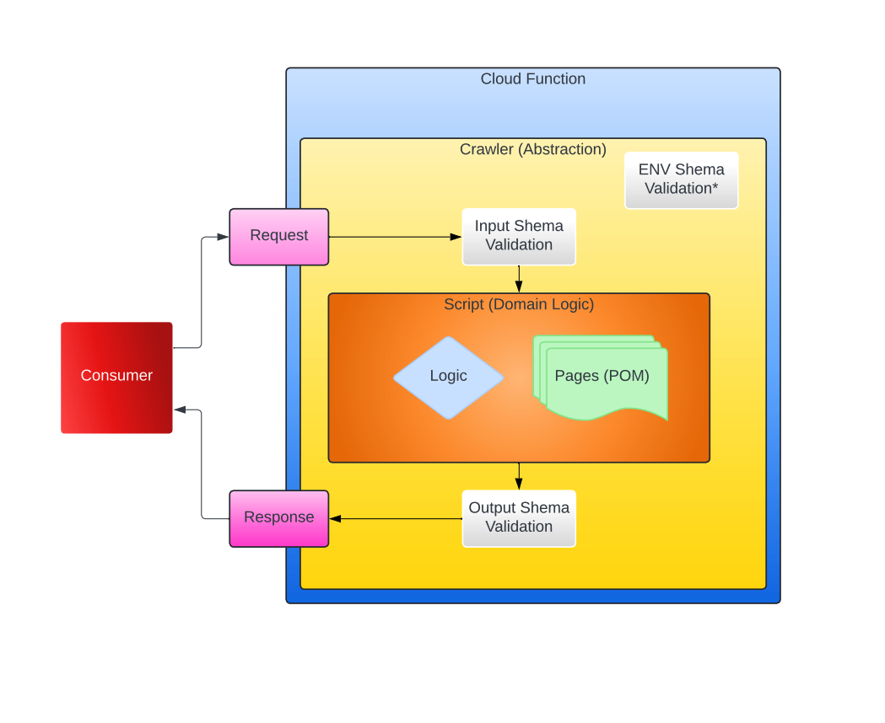

# Crawler Assessment

## Prerequisites

### System Dependencies

Install Node version 20. This project was configured and tested using Mac OS but should work with Windows or Linux with minimal config. If you have [nvm](https://formulae.brew.sh/formula/nvm) installed you can run the following in the project directory to set your node version.

```sh
nvm install
nvm use
```

### Project Dependencies

```sh
# Install node modules
npm i

# Create a `.env` file, if one is not present, manually using `sample.env` or with the script below.
cp sample.env .env
```

## Technical Assessment

### Time Estimation

This exercise should take ≈ 30-120 minutes.

### Requirements

Using the tooling provided, generate a crawler and write a playwright script that does the following:

1. Navigates to `https://eservices.nysed.gov/professions/verification-search`.
2. Search for the following license number `145661` by selecting license type `Physician (060)`.
3. Click details for this record.
4. Capture a pdf screenshot of the details page using playwright and store the pdf file in the downloads directory provided on the root of this project.
5. Zip the completed project into a single file and return it to your recruiter.

_You should only need to make changes to the generated script, pages and schema files._

### Generate Crawler

```sh
# When prompted to enter the crawler name "Simbiosis"
npm run gen:crawler
```

This script will generate the following boilerplate.

```sh
├── functions
│   └── simbiosis # Cloud Function Application (NO MODIFICATION)
│       └── src
│           ├── main.ts
│           └── simbiosis.crawler.ts 
└── libs
    └── playwright-scripts
    │   └── src
    │       └── lib
    │           └── functions
    │               └── simbiosis # Crawler Script (MODIFICATIONS HERE)
    │                   ├── pages # Crawler Script Pages (following Page Object Model)
    │                   │   ├── simbiosis-about.page.ts
    │                   │   └── simbiosis-home.page.ts
    │                   └── simbiosis.script.ts # Crawler Script Logic
    └── zod-schema
        └── src
            └── lib
                └── functions
                    └── simbiosis # Crawler Schema (MODIFICATIONS HERE)
                        ├── simbiosis-env.schema.ts # Runtime Environmental Variable Schema
                        ├── simbiosis-in.schema.ts # Cloud Function Input Schema
                        └── simbiosis-out.schema.ts # Cloud Function Output Schema
```

### Serving Crawler

```sh
# Serve the cloud function in one terminal
npx nx serve simbiosis
```

### Trigger Crawler Cloud Function

```sh
# Trigger the cloud function using your preferred http client (curl/get/postman)
curl --location 'http://localhost:30000' \
--header 'Content-Type: application/json' \
--data '{
    "ranBy": "Happy Developer"
}'
```

### Workflow



### Tools chain docs

- [Node JS](https://nodejs.org/en)
- [Node Version Manager](https://github.com/nvm-sh/nvm)
- [Typescript](https://www.typescriptlang.org)
- [Google Cloud Functions](https://github.com/GoogleCloudPlatform/functions-framework-nodejs)
- [Playwright](https://playwright.dev/docs/intro)
- [Page Object Model](https://playwright.dev/docs/pom)
- [Zod](https://zod.dev)
- [NX](https://nx.dev/getting-started/intro)